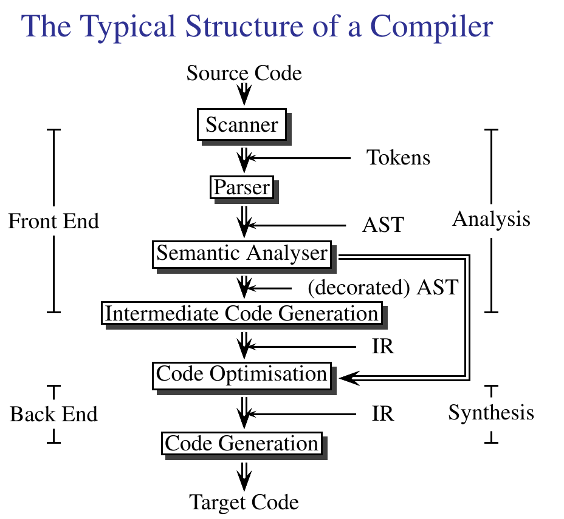

# ANTLR Demo

Repo containing a basic demo of ANTLR4.

# Links

 * [Home Page](https://www.antlr.org/)
 * [Grammars](https://github.com/antlr/grammars-v4)

# TODO

 * Get the picture of the "compiler architecture"
 * Create a picutre characters -> tokens -> parse tree
 * Construct some good examples

# Demo

## Background

 * DFAs / NFAs / regular expressions for the lexer
 * Context free grammars for the language
 * Associativity
 * Operator precedence

## Classic Arithmetic Grammar

 * Classic arithmetic expression grammar
 * Code generator
 * Grun some examples
 * Show .tokens, .interp, Lexer, Parser, Visitor code
 * Show main
 * Show evaluator
 * Show pretty

## Antler's Special Rules

 * Antlr arithmetic expression
 * Grun some examples
 * Show evaluator and pretty
 * Simpler grammar -> simpler code!

## Filter Expression

 * Grammar
 * Grun examples
 * Visitor strategy
 * Run some csv examples
